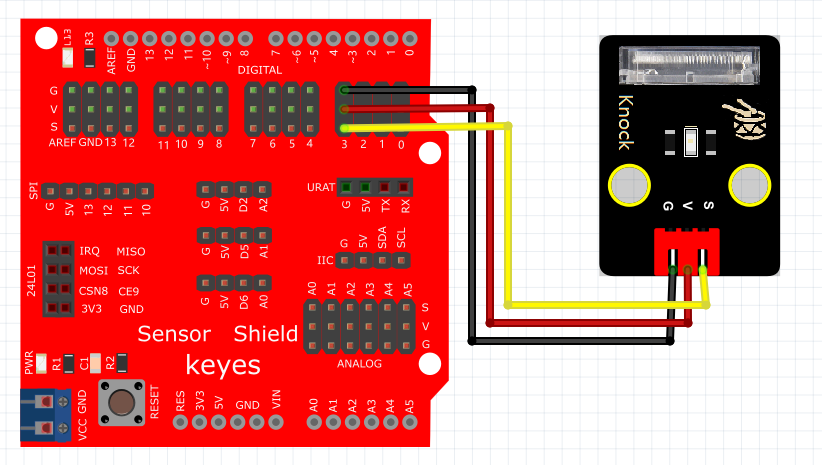

# Arduino


## 1. Arduino简介  

Arduino是一款开放源代码的电子原型平台，由硬件和软件组成，旨在让爱好者、学生和专业开发者能够轻松地创建互动项目。Arduino开发板由微控制器和其他电子元件组成，允许用户通过编程来控制项目中的输入和输出（例如传感器和电机）。其友好的编程环境和丰富的社区支持使得Arduino成为创客和教育领域的重要工具。Arduino可以用于各种项目，从简单的LED闪烁到复杂的机器人控制，广泛应用于电子艺术、物联网（IoT）、嵌入式系统以及自动化技术等多个领域。用户可以使用C/C++等语言进行编程，并且支持通过多个库快速实现各种功能。  

## 2. 连接图  

  

## 3. 测试代码  

```cpp  
int Led = 13; // 定义数字口13  
int Shock = 3; // 定义数字口3  
int val; // 定义数字变量val  

void setup() {  
    pinMode(Led, OUTPUT); // 将Led设置为输出  
    pinMode(Shock, INPUT); // 将Shock设置为输入  
}  

void loop() {  
    val = digitalRead(Shock); // 读取到数字口3的数值，并赋值给val  
    if (val == LOW) { // 当val为低电平时，Led亮起  
        digitalWrite(Led, HIGH); // Led亮起  
        delay(1000);  
    } else {  
        digitalWrite(Led, LOW); // Led变暗  
    }  
}  
```  

## 4. 测试结果  

按照上图接好线，烧录好代码，上电后，敲击该模块，板上的D13的LED指示灯和模块上D1灯亮起。


