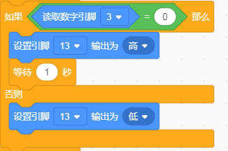

# KidsBlock

## 1. KidsBlock简介  

KidsBlock是一款基于图形化编程的教育平台，旨在帮助儿童和初学者直观地学习编程逻辑。通过将编程模块拖放到工作区，用户可以快速构建程序，而无需深入理解复杂的代码语法。KidsBlock支持多种硬件平台，包括Arduino，使得用户可以控制传感器、舵机和其他电子部件。其友好的用户界面和丰富的可编程模块使孩子们可以在创建有趣的项目中获得乐趣和成就感。该平台还支持Scratch等视觉编程语言， ermöglichen verantwortliche verwenden viele Anwendungsmöglichkeiten, от LEDs и моторы до датчиков и других компонентов.  

## 2. 连接图  

  

## 3. 测试代码  

1. 在事件栏拖出Arduino启动模块。  

     

2. 在引脚栏拖出两个设置引脚模式模块，一个设置为引脚3输入，另一个设置为引脚13输出。  

     

3. 在控制栏拖出重复执行模块。  

     

4. 在控制栏拖出判断模块，然后添加运算的等于模块，等于模块的左边添加读取数字引脚3模块，右边为0；满足条件时，第13引脚输出高电平并延时1秒，不满足条件时，第13脚输出低电平。  

     

## 4. 测试结果  

按照上图接好线，烧录好代码，上电后，敲击该模块，板上的D13的LED指示灯和模块上D1灯亮起。

