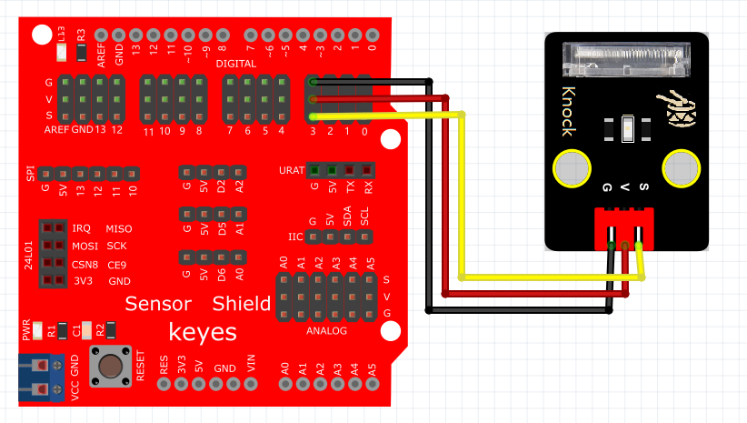

# Mixly

## 1. Mixly简介  

Mixly是一款基于图形化编程的教育平台，旨在让用户，尤其是儿童和初学者，通过直观的拖放界面轻松学习编程。用户可以通过将不同功能的编程模块拖放到工作区，快速构建复杂的程序，而不需要深入掌握传统编程语言的语法。Mixly支持Arduino、Raspberry Pi等多种硬件平台，用户能够直观地控制传感器、执行器等组件。其友好的界面设计和各类扩展模块，使得学生在制作互动项目的同时，培养他们的逻辑思维、创造力及解决问题的能力，是STEAM教育的一个重要工具。  

## 2. 连接图  

  

## 3. 测试代码  

1. 在变量栏拖出声明变量模块，设置变量名为val，类型为整数并赋值为0（数字0模块在数学栏里）。  

     

2. 在变量栏拖出变量val赋值模块，然后在输入/输出栏拖出数字管脚模块，设置管脚为3。  

     

3. 在控制栏拖出判断模块，并在模块的设置里添加一个否则项。  

     

4. 在逻辑栏拖出等于模块放到如果部分，等于模块的第一个格子放变量val模块，第二个格子放数字0模块。  

     

5. 在输入/输出栏拖出数字引脚设置模块，设置管脚为13，设为高电平并与一个延时1秒的模块放在判断模块的执行后面；复制一个数字引脚模块，设置管脚为13，设为低电平放在判断模块的否则后面。  

     

## 4. 测试结果  

按照上图接好线，烧录好代码，上电后，敲击该模块，板上的D13的LED指示灯和模块上D1灯亮起。

