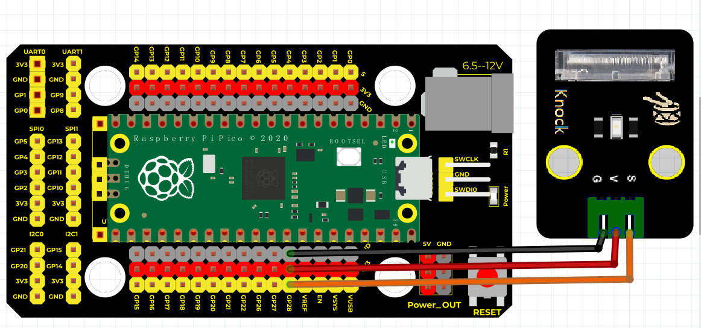

# Python


## 1. Python简介  

Python是一种高级编程语言，以其简洁易读的语法和强大的库而闻名。它是一种解释型语言，支持多种编程范式，包括面向对象、命令式和函数式编程，适合初学者和专业开发者。Python的应用场景广泛，包括Web开发、数据科学、人工智能、自动化脚本、游戏开发和科学计算等。其丰富的标准库和活跃的社区支持使得用户可以快速开发复杂的应用，并在各种平台上运行。Python在物联网（IoT）领域的应用与诸如MicroPython等轻量级实现结合使用时，能高效地在微控制器上运行，是嵌入式开发的重要选择之一。  

## 2. 连接图  

  

## 3. 测试代码  

```python  
import machine  
import utime  

led = machine.Pin(25, machine.Pin.OUT)  # 设置25脚为LED输出脚  
sensorPin = machine.Pin(28, machine.Pin.IN)  # 设置28脚为sensorPin输入脚  

while True:  
    if sensorPin.value() == 0:  # 判断sensorPin输入的值是否为0，如果是则LED灯亮，不是则灭  
        led.value(1)  # LED亮  
        utime.sleep(1)  # 延时1秒  
    else:  
        led.value(0)  # LED灭  
```  

## 4. 测试结果  

按照上图接好线，烧录好代码，上电后，敲击该模块，板上的LED指示灯和模块上D1灯亮起。


